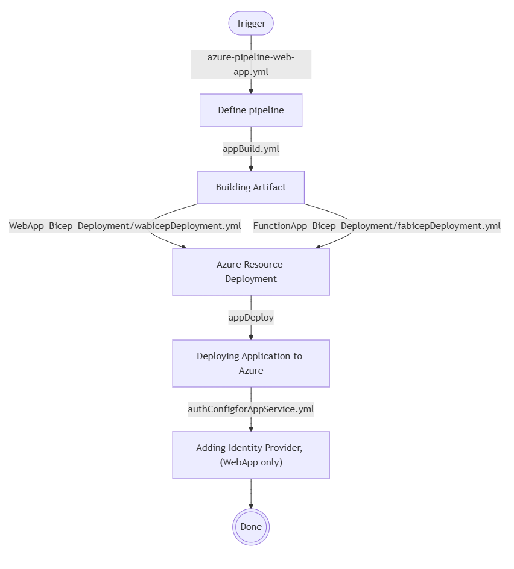
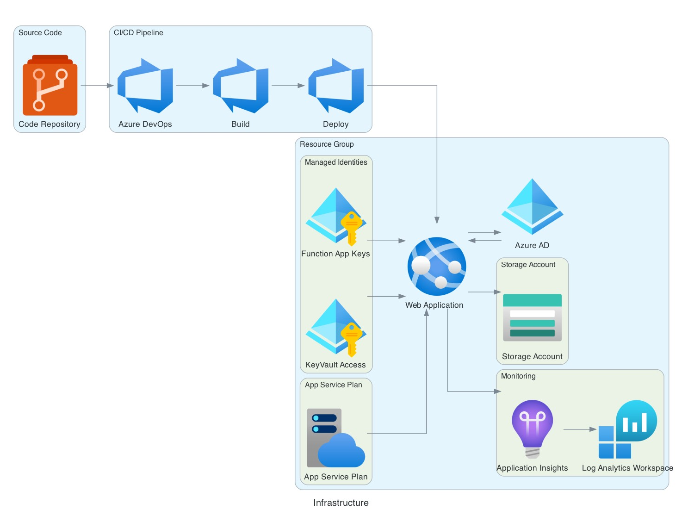

# Template-based Web App and Deployment Pipeline on Azure in an enterprise environment

## Description

This a Template repository dedicated for reusable templates across all our Web apps.  
Along with template files for ADO pipelines (.yml), we have stored bicep templates that are being used for provisioning Azure resources here.

## How to use template

Put the centralized pipeline files (`ado_pipeline_repo`) into a separate repository than the rest (web app template).  
Adapt the pipeline import in `azure-pipeline-web-app.yml` according to the pipeline repo name.

## Structure

### Files

```bash
ado_pipeline_repo/
├── WebApp_Bicep_Deployment/
│   ├── deploy/
│   │   ├── deploy.bicep
│   │   ├── resources.bicep
│   │   ├── nkd_pipeline_utils.py
│   └── wabicepDeployment.yml
├── authConfigforAppService.yml
├── appBuild.yml
├── appDeploy.yml
```

### Pipeline flow



### Azure infrastructure



## Azure DevOps setup

- Variables  
(defined in Pipeline/Library Variable Groups)

  - **sonarcloud**: sonarcloud-instance, sonarcloud-organization, sonarcloud-timeout
  - **azure**: azure_managed_identity_client_id, armConnectionProd, armConnectionDev

### Process of using template in main pipeline

`azure-pipeline-webapp.yml`

- Since the pipeline we are using comes from different repo, initiate the resources at the beginning of pipeline
    >
    ```bash
            resources:
                repositories:
                    - repository: Shared_Templates
                    type: git
                    name: your_subscription/ado_pipeline_repo
                    ref: refs/tags/v2.0
    ```

    ```bash
    - template: webAppBuild.yml@Shared_Templates
    ```

    For more details visit the offical documentation here. [Azure pipeline templates](https://learn.microsoft.com/en-us/azure/devops/pipelines/process/templates?view=azure-devops&pivots=templates-includes)

- If you are passing variables (tsv can also be passed) to templates, it is standard practice to pass parameters to templates.
- Using expressions to pass parameters to the template
    >
    ```bash
            - template: WebApp_Bicep_Deployment/wabicepDeployment.yml@Shared_Templates
                parameters:
                    projectId: $[stageDependencies.Build.BuildJob.outputs['setVars.projectId']]
                    projectName: $[stageDependencies.Build.BuildJob.outputs['setVars.projectName']]
                    serviceConnectionProd: $(armConnectionProd)
                    ${{ if eq(variables['Build.SourceBranchName'], 'main') }}:
                    armConnection: $(armConnectionProd)
                    ${{ else }}:
                    armConnection: $(armConnectionDev)

    ```

- Service connections must be parsed inside a template to task Apis like AzureWebApp@1, AzureCLI@2 etc, in a specific way. During template evaluation in the pipeline, variables can be expanded and the pipeline compiles successfully.

    Note: we use service connections keys from the DevOps variable group in `Pipelines/Library/azure`

    >
    step1: use microsyntax `$(armConnectionDev)` to parse service connection variable saved in variable group, pass it to a template as a parameter. Once the parameter has been passed into the template and then refernced to `Stage/Job/Task> Variables`, for actual azuresubscription input inside the task, it must be passed using expression syntax `${{ variables.serviceConnectionProd }}``.

    ```bash
    >> inside main Project/azure-pipeline.yml file 
        - template: WebApp_Bicep_Deployment/wabicepDeployment.yml@Shared_Templates
                parameters:
                    serviceConnectionProd: $(armConnectionProd)

    >> inside WebApp_Bicep_Deployment/wabicepDeployment.yml file 
        parameters:
        - name: serviceConnectionProd
            type: string

        stages:
        - stage: DeployBicep
            displayName: 'Deploy Bicep Template'
            dependsOn: Build
            condition: succeeded()
            variables:
                serviceConnectionProd: ${{ parameters.serviceConnectionProd }}

        jobs:
            - job: DeployBicepJob
            pool:
                vmImage: $(vmImageName)
            steps:
            - task: AzureCLI@2
                inputs:
                azureSubscription: ${{ variables.serviceConnectionProd }}
                scriptType: 'bash'
                scriptLocation: 'inlineScript'
                inlineScript: |
                    subscriptionId=$(az account list --query "[?isDefault].id" -o tsv)
                    echo "##vso[task.setvariable variable=subscriptionIdProd;isOutput=true]$subscriptionId"
                name: setSubscriptionIdProd
                displayName: 'Setting subscriptionIdProd variable'
    ```
